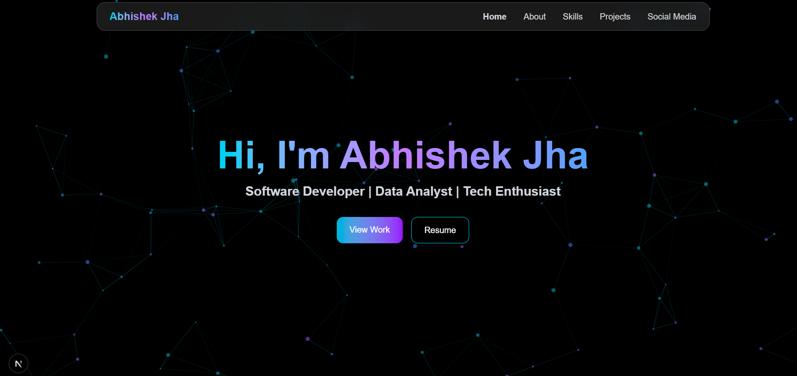
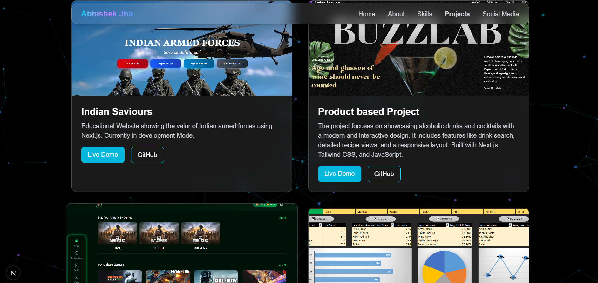

## Getting Started
First, run the development server:

```bash
npm run dev
# or
yarn dev
# or
pnpm dev
# or
bun dev
```
# Libraries used by me 
npm install react-tsparticles tsparticles
npm install framer-motion
npm install tsparticles-slim

Open [http://localhost:3000](http://localhost:3000) with your browser to see the result.

# Demo



